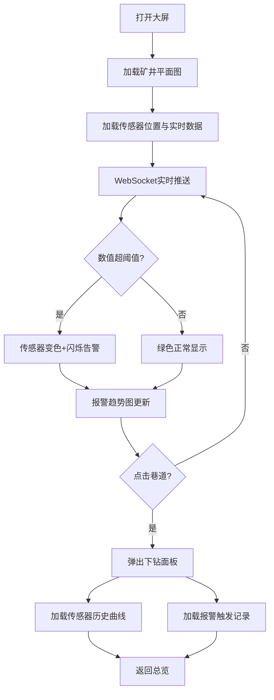

## 1. 产品概述
煤矿安全风险态势可视化大屏——面向矿长与调度中心的实时监控指挥平台，基于矿井采掘工程平面图动态呈现瓦斯/粉尘/CO/温度/风速传感器实时数值及三色预警标记，融合报警趋势分析、设备在线率、处置确认率与井下人员分布，支持巷道级下钻，辅助应急指挥决策。

## 2. 核心功能

### 2.1 用户角色
| 角色 | 使用场景 | 核心权限 |
|------|---------|---------|
| 矿长/调度员 | 大屏值守与应急指挥 | 查看全矿态势、下钻巷道、确认报警 |
| 安监员 | 日常巡检与报警处置 | 查看传感器详情、历史曲线 |

### 2.2 功能模块
1. **态势总览大屏**：矿井平面图 + 传感器实时数值 + 三色标记 + 人员分布
2. **瓦斯浓度热力图**：全矿瓦斯浓度空间分布热力渲染
3. **报警趋势面板**：近24小时报警数量趋势曲线 + 类型分布饼图
4. **设备与处置面板**：设备在线率环形图 + 今日报警确认率
5. **巷道下钻面板**：点击巷道查看传感器历史曲线及报警触发记录

### 2.3 页面详情
| 页面名称 | 模块名称 | 功能描述 |
|---------|---------|---------|
| 态势总览大屏 | 矿井平面图 | 基于Leaflet/Canvas的矿井采掘平面图，传感器以图标+数值+三色(绿/黄/红)标记展示 |
| 态势总览大屏 | 瓦斯热力图 | 叠加在平面图上的瓦斯浓度热力图层，支持切换显示/隐藏 |
| 态势总览大屏 | 粉尘超标闪烁 | 粉尘超标区域红色闪烁动画告警 |
| 态势总览大屏 | 人员分布 | 井下人员定位图标展示，不同区域人员数量气泡 |
| 态势总览大屏 | 报警趋势曲线 | 右侧面板，近24小时按小时聚合的报警数量折线图 |
| 态势总览大屏 | 报警类型分布 | 饼图展示当前报警按类型(瓦斯/粉尘/CO/温度/风速)分布 |
| 态势总览大屏 | 设备在线率 | 环形图展示设备在线/离线/故障占比 |
| 态势总览大屏 | 今日报警确认率 | 进度条展示已确认/未确认报警比例 |
| 巷道下钻面板 | 传感器历史曲线 | ECharts折线图展示选中巷道下传感器近1小时数值曲线 |
| 巷道下钻面板 | 报警触发记录 | 列表展示该巷道近期报警记录及处置状态 |

## 3. 核心流程
用户打开大屏 → 加载矿井平面图与传感器位置 → WebSocket推送实时数据刷新 → 传感器数值超阈值自动变色 → 点击巷道区域弹出下钻面板 → 查看历史曲线与报警记录 → 返回总览

## 4. 用户界面设计

### 4.1 设计风格
- 主色调：深蓝黑(#0a1628)背景 + 青蓝(#00d4ff)强调色 + 琥珀黄(#ffb800)预警 + 危险红(#ff4757)报警
- 按钮风格：圆角微光按钮，悬浮发光效果
- 字体：标题使用 DIN Alternate 数字字体，正文使用思源黑体
- 布局：左右面板 + 中央地图，科技感暗色大屏风格
- 图标：线性描边图标，带发光效果

### 4.2 页面设计概览
| 页面名称 | 模块名称 | UI元素 |
|---------|---------|--------|
| 态势总览大屏 | 中央地图区 | 深色背景矿井平面图，传感器图标+数值标签，三色标记，热力图叠加层，人员分布气泡 |
| 态势总览大屏 | 左上-报警趋势 | 半透明暗色卡片，24小时折线图，渐变面积填充 |
| 态势总览大屏 | 左下-报警类型分布 | 半透明暗色卡片，环形饼图，中心显示总数 |
| 态势总览大屏 | 右上-设备在线率 | 半透明暗色卡片，环形进度图，下方显示在线/离线/故障数字 |
| 态势总览大屏 | 右下-确认率统计 | 半透明暗色卡片，水平进度条，已确认/未确认数字 |
| 态势总览大屏 | 顶部标题栏 | 居中标题"煤矿安全风险态势感知平台"，左上时间，右上设备状态汇总 |
| 巷道下钻面板 | 历史曲线 | 弹出侧面板，ECharts多折线图，可切换传感器类型 |
| 巷道下钻面板 | 报警记录 | 表格列表，状态标签色块，时间/类型/级别/状态列 |

### 4.3 响应式
- 桌面优先（1920×1080 大屏适配）
- 最小支持 1366×768
- 触控优化（大屏触控一体机场景）

### 4.4 动效设计
- 传感器数值变化：数字滚动动画
- 报警触发：图标脉冲闪烁 + 红色波纹扩散
- 面板切换：滑入/淡入动画
- 热力图：渐变呼吸动画
- 数据刷新：折线图平滑过渡
