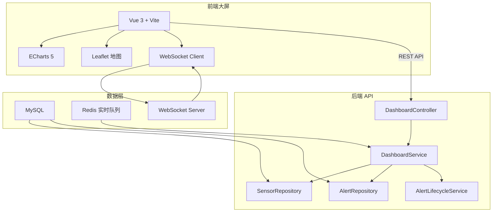
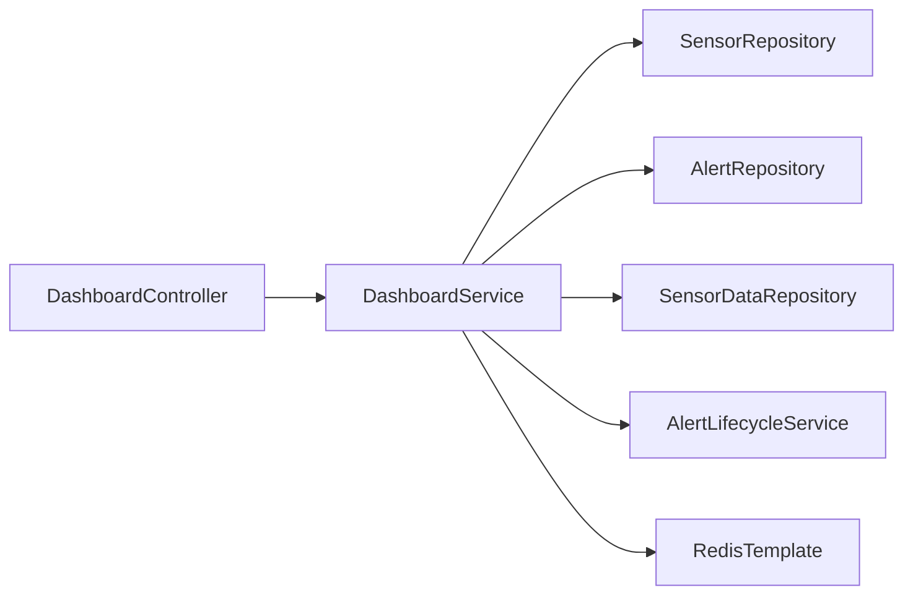

## 1. 架构设计



## 2. 技术描述
- 前端：Vue 3 + Vite + ECharts 5 + Leaflet + WebSocket
- 初始化工具：Vite
- 后端：Spring Boot 3.2 + MyBatis Plus（已有项目）
- 数据库：MySQL + Redis
- 实时通信：Netty WebSocket（已有服务）

## 3. 路由定义
| 路由 | 用途 |
|------|------|
| / | 大屏主页面 |
| /tunnel/:id | 巷道下钻详情（弹层，非独立页面） |

## 4. API 定义

### 4.1 GET /api/dashboard/overview
全矿概览数据，包含传感器总数、在线数、今日报警数、确认率
```typescript
interface DashboardOverview {
  sensorTotal: number;
  sensorOnline: number;
  sensorOffline: number;
  sensorFault: number;
  onlineRate: number;
  todayAlertTotal: number;
  todayAlertConfirmed: number;
  confirmRate: number;
  undergroundPersonnel: number;
  timestamp: string;
}
```

### 4.2 GET /api/dashboard/sensor-realtime
所有传感器实时数值列表，用于地图标记
```typescript
interface SensorRealtime {
  sensorId: string;
  sensorName: string;
  sensorType: string;
  location: string;
  tunnel: string;
  coordinatesX: number;
  coordinatesY: number;
  currentValue: number;
  unit: string;
  status: number; // 0-正常 1-预警 2-报警
  lastUpdateTime: string;
}
```

### 4.3 GET /api/dashboard/alert-trend
近24小时报警趋势
```typescript
interface AlertTrend {
  hours: string[]; // ["00:00","01:00",...]
  counts: number[];
  byType: {
    type: string;
    counts: number[];
  }[];
}
```

### 4.4 GET /api/dashboard/alert-type-distribution
报警类型分布
```typescript
interface AlertTypeDistribution {
  type: string;
  count: number;
}[]
```

### 4.5 GET /api/dashboard/device-status
设备在线率统计
```typescript
interface DeviceStatus {
  onlineCount: number;
  offlineCount: number;
  faultCount: number;
  onlineRate: number;
}
```

### 4.6 GET /api/dashboard/personnel-distribution
井下人员分布
```typescript
interface PersonnelDistribution {
  zoneCode: string;
  zoneName: string;
  count: number;
  coordinatesX: number;
  coordinatesY: number;
}[]
```

### 4.7 GET /api/dashboard/heatmap
瓦斯浓度热力图数据
```typescript
interface HeatmapPoint {
  coordinatesX: number;
  coordinatesY: number;
  value: number;
}[]
```

### 4.8 GET /api/dashboard/tunnel/{tunnelId}/sensor-history
巷道下钻 - 传感器历史曲线
```typescript
interface SensorHistory {
  sensorId: string;
  sensorName: string;
  timestamps: string[];
  values: number[];
}[]
```

### 4.9 GET /api/dashboard/tunnel/{tunnelId}/alert-records
巷道下钻 - 报警触发记录
```typescript
interface TunnelAlertRecord {
  alertNo: string;
  sensorName: string;
  level: string;
  alertValue: number;
  status: number;
  createdAt: string;
}[]
```

## 5. 服务端架构



## 6. 数据模型
已有数据模型无需新建表，复用现有 sensors、alerts、sensor_data 表。人员分布使用模拟数据（等待人员定位系统对接）。

### 前端数据模型
前端通过 REST API + WebSocket 双通道获取数据：
- REST API：页面初始化时批量加载
- WebSocket：实时增量推送（传感器数值变化、新报警触发、状态变更）
